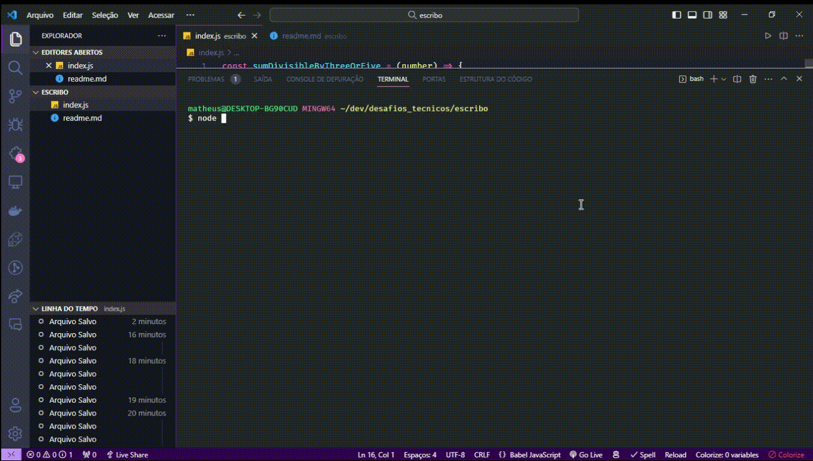

# ESCRIBO

_DESAFIO TÉCNICO 1!!!_

Ao desenvolver esta função, minha principal ênfase foi priorizar a legibilidade e usabilidade. Adotei boas práticas para nomeação de variáveis e implementei manipulação de erros, garantindo que a função entregasse o melhor resultado possível.

### Programas Necessários

Para executar o projeto, é importante que o Node.js esteja instalado na máquina. Caso não esteja, baixe e instale o Node.js seguindo [este link](https://nodejs.org/en/download).

### Executando o projeto

Após clonar o repositório, navegue até a pasta do projeto e execute o seguinte comando:

```
node index.js
```

Para testar diferentes resultados, basta alterar o valor da variável **numberToTest**, assim como no exemplo abaixo:


